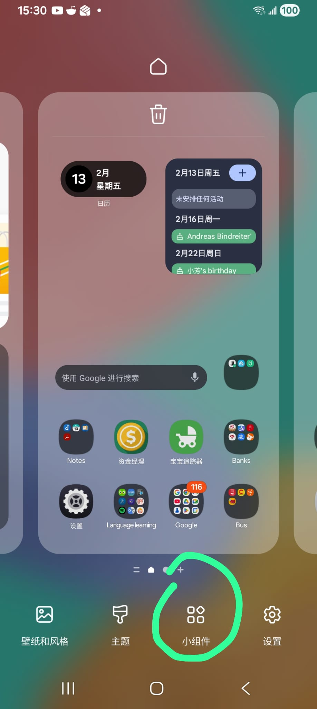
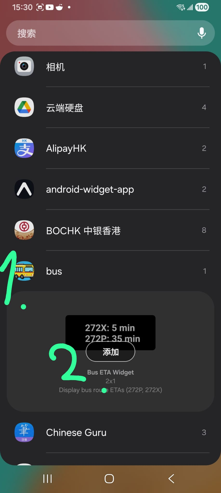
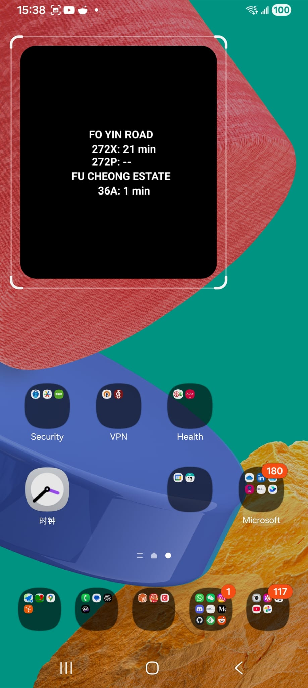

# :bus: Expo React Native Bus App

[](https://josefgst.github.io/blog/2026/02/20/oncoming_bus-a-more-convenient-way-to-check-the-kmb-bus-arrival-time-hk/) []() []()

## :mag: Overview
A simple React Native app built with Expo, to fetch KMB bus arrival times and the ability to save favorite bus stops. The favorite bus stops are also displayed in an Android widget, which is the main advantage compared to other similar apps.

<div style="display: flex; gap: 16px;">
  
  
  
</div>

## :star: Features
- :dollar: Free and open source
- :heart: Save favorite bus stops
- :iphone: Widget support for Android
- :no_entry_sign: No annoying Ads
- :zap: Fast loading time

## 🚀 Getting Started
1. **📦 Install dependencies**
    ```bash
    npm install
    ```
2. **▶️ Run the app**
    - 🏁 Start Expo:
       ```bash
       npx expo start
       ```
    - 🤖 Run on Android:
       ```bash
       npx expo run:android
       ```
    - 🍏 Run on iOS (macOS required):
       ```bash
       npx expo run:ios
       ```
    - 🌐 Run on Web:
       ```bash
       npm run web
       ```

## 🏗️ Build & Deployment
1. **📦 Build Android release APK**
   ```bash
   npx expo run:android --variant release
   ```
2. **📲 Install APK on device**
   ```bash
   adb install -r android/app/build/outputs/apk/release/app-release.apk
   ```
## Widget Setup
1. long press on the home screen and select "Widgets"
2. find "Bus ETA Widget" and drag it to the home screen
3. select a bus stop from the list to display its ETA on the widget
 
<div style="display: flex; gap: 16px;">
  
  
  
</div>

## 🗂️ Folder Structure
- `app/` — 🖥️ Main screens, navigation, and routes
- `widget/` — 📱 Android widget implementations and handlers
- `app-example/` — 🧪 Demo screens, advanced UI, hooks, and components
- `utils/` — 🛠️ Shared utility functions (API, formatting, storage)
- `android/` & `ios/` — 🤖🍏 Native platform integration
- `assets/` — 🖼️ Images and static assets

## 🔄 Key Workflows
- **🧹 Lint:**
   ```bash
   npm run lint
   ```

## 🧩 Widget Integration
- Android widgets are implemented in `widget/` and registered via `widget-registration.ts`.
- Widget configuration is managed in `app.json`.

## TODO's and Bugs:
- [ ] :star:star button sometimes doesen't add the bus stop to favorites
- [ ] :warning: widget sometimes get stuck on "Loading..."
- [ ] :iphone: IOS support for widget (currently only Android is supported)

## 📚 Resources
- [📖 Expo Documentation](https://docs.expo.dev/)
- [📖 React Native Documentation](https://reactnative.dev/)

